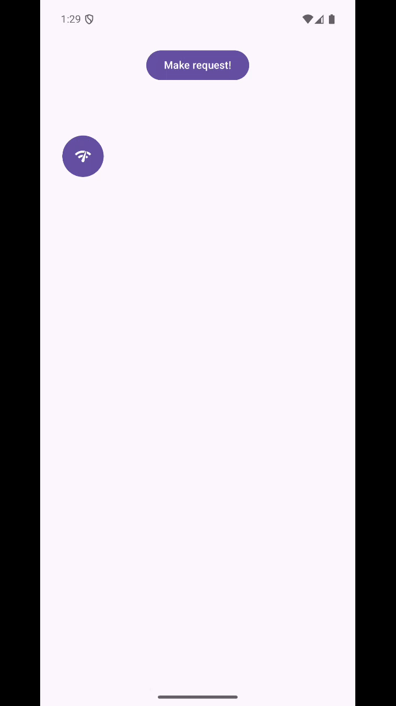
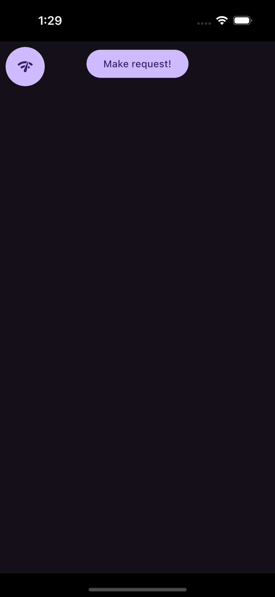

# LensLogger


LensLogger is a Kotlin Multiplatform (KMP) library for Android, iOS and Desktop that makes debugging network requests effortless.
It automatically logs all Ktor network requests and responses, and provides a built-in UI to inspect these logs directly in your app. 
This helps you quickly identify issues and monitor network activity during development.

## Features
- ✨ Seamless integration with Ktor HTTP client
- 📱 Works on both Android and iOS (KMP)
- 🔍 Logs all network requests and responses
- 🖥️ Built-in UI for real-time log inspection
- 🛠️ Minimal setup and easy to use
- ✨ DataStore Visualizer

## Demo

| Android                                                                       | iOS                                                                       | Desktop (Windows)                                                            |
|-------------------------------------------------------------------------------|---------------------------------------------------------------------------|------------------------------------------------------------------------------|
|  |  |
| 


## Installation

Add the LensLogger artifact to your module's commonMain dependencies:

```kotlin
dependencies {
    implementation("io.github.farhazulmullick:lens-logger:<version>")
}
```
Or add to your `libs.versions.toml`:
```toml
lensLoggerVersion = "<version>"
lens-logger = { module = "io.github.farhazulmullick:lens-logger", version.ref = "lensLoggerVersion" }
```

### Publish to Maven Local (try in another project)

From this repository root:

```bash
./gradlew publishToMavenLocal
```

Artifacts use `groupId` **`io.github.farhazulmullick`**, current `version` **`1.2.0-SNAPSHOT`** (see each module’s `build.gradle.kts` under `mavenPublishing { coordinates(...) }`). They are installed under `~/.m2/repository/io/github/farhazulmullick/`.

**In a separate Android (or KMP) project**, add Maven Local and the dependency.

`settings.gradle.kts` (top-level `dependencyManagement` / `pluginManagement` repositories, or `dependencyResolutionManagement.repositories`):

```kotlin
mavenLocal()
```

`app/build.gradle.kts` (or your shared `commonMain` source set for KMP):

```kotlin
dependencies {
    implementation("io.github.farhazulmullick:lens-logger:1.2.0-SNAPSHOT")
}
```

Your app must already use **Jetpack Compose** (and compatible Kotlin / Compose Compiler versions) because `lens-ui` is Compose-based. After changing the library, run `publishToMavenLocal` again and **Sync** / **Refresh dependencies** in the consumer so Gradle picks up the new snapshot.

## Usage

### 1. Integrate with Ktor Client

In your shared code (e.g., `commonMain`):

```kotlin
import io.github.farhazulmullick.lenslogger.*
import io.ktor.client.*
import io.ktor.client.engine.*
import io.ktor.client.plugins.logging.*

val client = HttpClient(engine) {
    // Replace install(Logging) with this.
    // Log request/response in Logcat and LensUi as well.
    LensHttpLogger {
        level = LogLevel.ALL
        logger = object : Logger {
            override fun log(message: String) {
                Napier.d(message = message)
            }
        }
    }.also { 
        // setup up nappier logger.
        Napier.base(DebugAntilog()) 
    }
}

/******************* OR ********************/
/** Install only LensLogger **/

val client = HttpClient(engine) {
    // body 
    install(LensHttpLogger){
        level = LogLevel.ALL
    }
}

```

### 2. Setup LensApp UI

Simply wrap your app's root composable with `LensApp`. This will enable the LensLogger UI and log request/response in your app.


```kotlin
import io.github.farhazulmullick.lenslogger.ui.LensApp
import androidx.compose.ui.Modifier

LensApp(
    modifier = Modifier.fillMaxSize(), 
    // by default enabled, set to false to disable.
    showLensFAB = true,
    // Optional: For DataStore Visualizer
    dataStores = listOf(DataStores<Preferences>) 
) {
    // Your app content goes here
    App()
}
```

This will display your app content and allow you to open the LensLogger UI overlay for network log inspection.

> **Note:** Make sure you have set up LensLogger with your Ktor client as shown above in your network module.

### 2b. Android: one-time install (no `LensApp` wrapper)

For apps with **multiple activities** or **no single Compose root**, register once from your `Application` (main thread). By default (`LensEntryMode.WINDOW_OVERLAY`), this adds a `ComposeView` on top of each activity’s `android.R.id.content` so the Lens FAB appears without wrapping your root composable. For a **notification-only** entry (no overlay), see **2c**.

```kotlin
import android.app.Application
import io.github.farhazulmullick.lenslogger.ui.LensAndroid
import io.github.farhazulmullick.lenslogger.ui.LensInstallConfiguration

class MyApp : Application() {
    override fun onCreate() {
        super.onCreate()
        LensAndroid.install(
            this,
            LensInstallConfiguration(
                dataStoresProvider = { ctx ->
                    // Return the same DataStore instances you would pass to LensApp
                    emptyList()
                },
                showLensFAB = true,
                sheetGesturesEnabled = false,
                activityFilter = { activity -> true },
            ),
        )
    }
}
```

Register `android:name=".MyApp"` on `<application>` in the manifest. Call `LensAndroid.uninstall(this)` to remove overlays and/or cancel the persistent notification (same `Application` instance as `install`).

### 2c. Android: persistent notification + `LensActivity` (no window overlay)

Use `LensEntryMode.PERSISTENT_NOTIFICATION` to show an **ongoing notification** that opens `LensActivity` with the same full-screen inspector as the in-app bottom sheet (`LensContent`). No `ComposeView` is attached to your activities.

- The library merges **`POST_NOTIFICATIONS`** (API 33+). Request runtime permission before or after `install`; if it is missing at install time, Lens logs a warning and skips posting until you call **`LensAndroid.refreshPersistentNotification(application)`**.
- You can also open the UI with **`LensActivity.createIntent(context)`** from your own code.
- **`LensAndroid.uninstall`** cancels the notification and clears cached `DataStore` references used by `LensActivity`.

```kotlin
import android.app.Application
import io.github.farhazulmullick.lenslogger.ui.LensAndroid
import io.github.farhazulmullick.lenslogger.ui.LensEntryMode
import io.github.farhazulmullick.lenslogger.ui.LensInstallConfiguration

class MyApp : Application() {
    override fun onCreate() {
        super.onCreate()
        LensAndroid.install(
            this,
            LensInstallConfiguration(
                entryMode = LensEntryMode.PERSISTENT_NOTIFICATION,
                dataStoresProvider = { ctx -> emptyList() },
            ),
        )
    }
}
```

**iOS:** A similar “entry without wrapping the whole Compose tree” experience would use platform APIs (e.g. local notifications, deep links, or share extension); it is not implemented in this milestone.

## License

This project is licensed under the MIT License - see the [LICENSE](./LICENSE) file for details.
